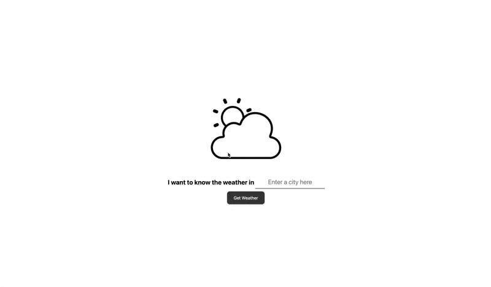

# Simple Weather API Static Site
## Setup

1. Clone the repository.
2. Get a free api key from https://www.weatherapi.com/
3. Create a `config.js` file in the root of the project with the following content:

    ```javascript
    const API_KEY = "your_api_key_here";
    ```

4. Open `index.html` in your browser to run the application.
